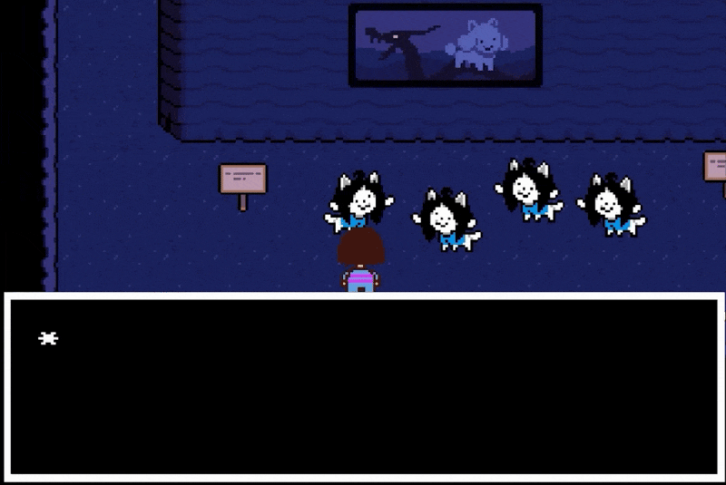

# hOI! im tEMMIE!! and dis my friend... tEMMIE!!
  

## About Me
henlo! chronically online since 1984  
b.tech student in my final year with a dysfunctional sleep schedule
majoring in CyberSecurity, minoring in DevOps and making god knows what in Unity  
I do many qol and automation projects but never tend to upload them because honestly, they dont feel up to the mark for me.  
I hate how lazy AI has made me so I only keep work of the best quality with me, rest all is temporary.  
the voices are getting louder, they demand sacrifice...
<!-- Osu! stats -->

<!-- Discord Presence -->

<!-- Steam Presence -->

## technologia!

## tEMMIE has goals... 
- [ ] Actually make meaningful contributions to opensource
- [ ] Master .NET
- [ ] Learn DSA properly (My ass is not learning this shi)
- [x] Make a portfolio website
- [ ] Make a personal website/showcase (hosted and everything)

## Projects worth showcasing (there are none)

- [llogin](https://github.com/saddexed/llogin) - Stupid university with its stupid captive portal that doesnt stupid work
- [osu-stats-embed](https://github.com/saddexed/osu-stats-embed) - Embed your osu! stats on your github profile! (or any website really)
- [LapKeys](https://github.com/saddexed/LapKeys) - To all my gamers with no software support for brightness or refresh-rate out there, I gotchu.
- [Prime Player Tweaks](https://github.com/saddexed/Prime-Player-Tweaks) - Functionality and CSS tweaks for the PrimeVideo player

----------------------------------------------------
*YOUR POWERS ARE MINE...* 
***FEARRR MAGNETO***  
Made by [saddexed](https://github.com/saddexed) 
